# Hoja de la administración — la operación de las tres zonas en una pantalla

> Para la administradora durante el piloto (y para la dirección, que tiene los mismos permisos más la gestión de cuentas). Se lee en 20 minutos. Las pantallas son capturas reales del sitio de pruebas con una cuenta de prueba de administración; los nombres del personal están reemplazados por «Técnico 1», «Jefe de zona 2»…
>
> **Las capturas son del 13 de septiembre de 2026 y muestran rótulos anteriores.** Desde el 24 de septiembre de 2026 el sistema usa el vocabulario único (los mismos términos para todos los roles, en pantalla, PDF, Excel y correos), y esta hoja ya usa esos términos. Si una captura no coincide con la hoja, manda el texto de la hoja: las capturas se vuelven a tomar cuando se pueda correr `capturar_pantallas.mjs` contra el sitio de pruebas.

## Las palabras que usa el sistema

- **Orden**: el trabajo que pide KFC, identificado por su **aviso SAP**.
- **OT INDUSTEC**: el documento que emite el técnico, **de evaluación** (la visita dejó la orden abierta) o **de cierre**. El PDF sigue titulado «ORDEN DE TRABAJO INDUSTEC» y su número sigue siendo OT-NNNN.
- **Solicitud**: lo que abre el técnico cuando el equipo no quedó operativo y hace falta un repuesto, un taller, una garantía o una baja.
- **Cerrada** nunca va sola: «cerrada en SAP», «cerrada sin atención». Lo que INDUSTEC ya terminó y falta cerrar en SAP es **«atendida, por cerrar en SAP»**.
- El jefe de zona **valida**, KFC **decide** y la administración **resuelve**.

## Qué ves

**Todo**: las tres zonas (ZONA UIO, ZONA LARB y ZONA CUENCA-LOJA), cada una separada, y el total general. Durante el piloto solo UIO trabaja con la app; LARB y CUENCA-LOJA siguen apareciendo con las órdenes que llegan de SAP, y podrás asignarlas y verlas, pero sus técnicos aún no entran.

Entras en `https://darkviolet-armadillo-872352.hostingersite.com/ot/login.php`. La primera vez el sistema pide cambiar la clave temporal. Ver [`CUENTAS.md`](CUENTAS.md).

## 1. Inicio: lo que te toca ahora, y las tres zonas

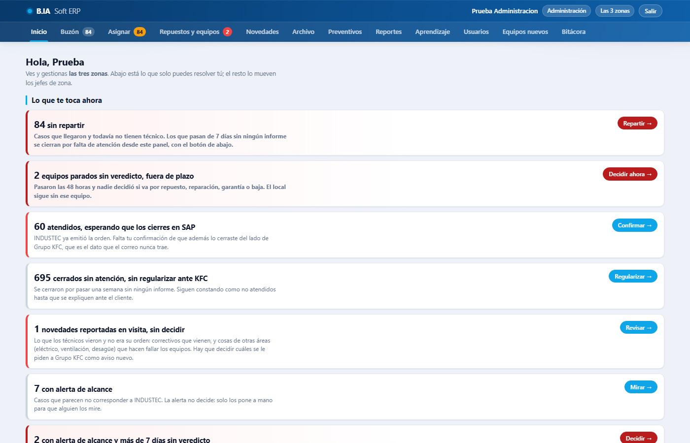

Arriba, **«Lo que te toca ahora»**: cada línea es algo que espera por ti, con su cifra (y la zona entre paréntesis) y el botón que te deja delante de esas órdenes. Solo aparecen las líneas que tienen algo.

| Línea | Qué es | Botón y dónde te lleva |
|---|---|---|
| N órdenes sin asignar | Llegaron del correo de SAP y todavía no tienen técnico | **Asignar** → Asignación |
| N solicitudes vencidas (más de 48 h sin validar) | Nadie validó la vía y el local sigue con el equipo deshabilitado | **Validar** → Repuestos y equipos, «Vencidas (48 h)» |
| N solicitudes por validar, a tiempo | El plazo de 48 horas todavía corre | **Ver** → Repuestos y equipos, «Por validar» |
| N atendidas, por cerrar en SAP | INDUSTEC ya emitió la OT INDUSTEC de cierre; falta tu confirmación de que la cerraste en SAP | **Confirmar** → Buzón, filtrado |
| N en revisión, por resolver | Un jefe de zona te la mandó con el motivo escrito | **Resolver** → Buzón, filtrado |
| N cerradas sin atención, sin regularizar ante KFC | Pasó una semana sin ninguna OT INDUSTEC y la orden se cerró; falta explicarla ante KFC | **Regularizar** → Buzón, filtrado |
| N novedades reportadas o en estudio, por decidir | Lo que los técnicos vieron en las visitas | **Revisar** → Novedades |
| N fuera del área, por decidir | Órdenes que parecen no ser de INDUSTEC; la alerta no decide, tú resuelves | **Resolver** → Buzón, filtrado |
| N asignadas hace 3+ días, a espera de informe técnico | Tienen técnico y todavía ninguna OT INDUSTEC | **Revisar** → Buzón, filtrado |
| N solicitudes validadas, por registrar en SAP | El jefe ya validó diagnóstico y vía; falta el número del requerimiento | **Registrar** → Repuestos y equipos, «Por registrar en SAP» |
| N equipos nuevos por confirmar | Un técnico registró un equipo que no estaba en la lista del local | **Confirmar** → Equipos nuevos |

Debajo de la tarjeta por zona, si hay órdenes sin ninguna OT INDUSTEC hace más de 7 días, sale el botón **«Cerrar por falta de atención»**, con confirmación: **no es automático**, lo decides tú. Las cerradas quedan en el buzón para regularizarlas ante KFC; no se borran ni se dan por cerradas en SAP.

Más abajo: **«Equipos deshabilitados · el plazo de 48 horas»** (Vencidas (48 h) · Por validar, a tiempo · Validadas a tiempo · Validadas tarde) y **«Cómo va el buzón»** (Órdenes nuevas en 7 días · Con fecha SAP hoy · A espera de repuesto · TOTAL DE ÓRDENES ABIERTAS).

### La tarjeta «Por zona»: cómo se lee

Encima de las tarjetas va una línea, **solo para la administración**, con el **TOTAL GENERAL DE ÓRDENES ABIERTAS (UIO + LARB + CUENCA-LOJA)**, la cifra de cada zona y sus equipos deshabilitados y operativos: es la fila del total del RESUMEN del STATUS. Si hay órdenes de OTRA ZONA o **sin zona** (el local no calza con el maestro), sale otra línea con ellas. Después, una tarjeta por zona con cuatro filas:

| Fila | Qué cuenta | Debajo, «de ellas» |
|---|---|---|
| **ÓRDENES ABIERTAS** | Órdenes que ya tienen **OT INDUSTEC de evaluación** y les falta la de cierre, más **todas** las que están a espera de repuesto (aunque no tengan OT: hubo visita o diagnóstico) | a espera de repuesto; sin asignar (una OT INDUSTEC cuya firma no se reconoció), solo si hay |
| **ÓRDENES A ESPERA DE INFORME TÉCNICO** | Órdenes **sin ninguna OT INDUSTEC** emitida: sin asignar, o asignadas sin OT todavía | sin asignar; asignadas hace 3+ días; fuera del área, por decidir; con OT INDUSTEC no emitida (la app la numeró pero no salió), solo si hay |
| **EQUIPOS DESHABILITADOS** | Órdenes del total cuyo dato más reciente del equipo dice **Deshabilitado**. **No se suma**: es una parte del total | vencidas (48 h); con equipo operativo; sin dato del equipo, solo si hay |
| **TOTAL DE ÓRDENES ABIERTAS** | **ÓRDENES ABIERTAS + ÓRDENES A ESPERA DE INFORME TÉCNICO**: todo lo que INDUSTEC todavía no termina | — |

El pie de cada tarjeta dice lo que **no** está en el total (o ya está dentro): **«Fuera del total: atendidas, por cerrar en SAP»**, **«Dentro del total: en revisión, por resolver»** y **«Fuera del total: cerradas sin atención, sin regularizar ante KFC»**.

Cada cifra es un enlace al buzón con **exactamente esas órdenes**: la cifra y las filas del enlace son siempre iguales. Si una fuente no se pudo leer, la cifra dice **«no disponible»** (nunca 0) y debajo se explica qué fuente falta.

**No es la cifra de SAP.** La tarjeta cuenta el buzón de B.IA: las órdenes de los últimos 90 días que llegaron por el correo de SAP (correctivos, bajas y constructivos). El servidor no conoce el estado de SAP, y el correo trae más o menos la mitad de las órdenes que SAP tiene abiertas: no avisa reaperturas ni cierres (cotejo del 10 de septiembre de 2026: SAP 62, buzón 31). El ícono ⓘ de cada tarjeta lo recuerda. Diferencias que vas a notar frente a tu STATUS:

- El total **ya no incluye las atendidas**: esas van al pie, «Fuera del total».
- «asignadas hace 3+ días» ya no cuenta las que tienen OT INDUSTEC de evaluación: esas están en ÓRDENES ABIERTAS.
- Un trabajo con varios avisos enlazados como continuidad cuenta **una sola vez**.
- Si una OT INDUSTEC posterior dice que el equipo quedó Operativo, la orden sale de EQUIPOS DESHABILITADOS aunque la solicitud siga en trámite. La solicitud vencida no se pierde: sigue en «Equipos deshabilitados · el plazo de 48 horas».
- Si tu hoja y la tarjeta difieren en una zona, revisa primero el rango de la fórmula del RESUMEN: la tarjeta cuenta todas las órdenes, sin rango fijo.

## 2. Buzón de órdenes: resolver sobre cada orden

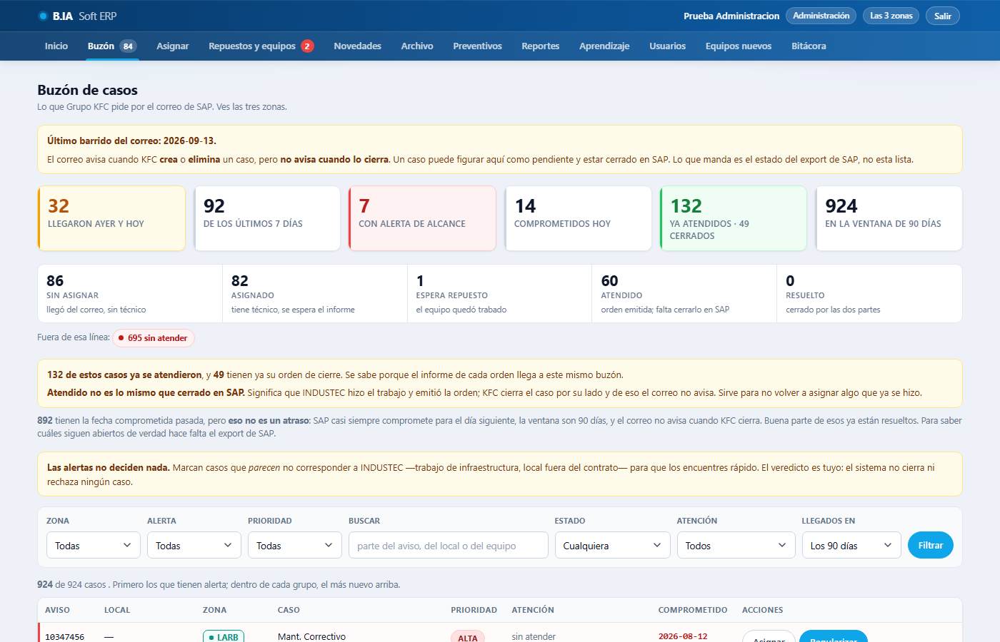

Todas las órdenes de SAP de los últimos 90 días, con su estado. Filtros por **zona**, alerta, prioridad, estado, **OT INDUSTEC** (sin OT INDUSTEC · con OT INDUSTEC de evaluación · con OT INDUSTEC de cierre), otros trabajos, días de llegada y texto. **«Órdenes sin local identificado»** agrupa las que llegaron con un local que el maestro no reconoce, para corregirlas.

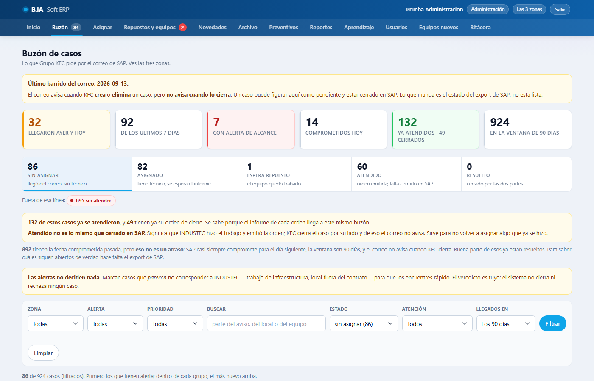

| Estado | Qué significa |
|---|---|
| sin asignar | Llegó del correo de SAP y todavía no tiene técnico |
| asignada | Ya tiene técnico |
| en revisión | El jefe de zona te la mandó con un motivo; tú la resuelves |
| a espera de repuesto | El técnico ya fue o diagnosticó, y el trabajo depende de un repuesto, un taller, una garantía o una baja |
| atendida, por cerrar en SAP | INDUSTEC terminó su parte (OT INDUSTEC de cierre o enlace de continuidad); falta que la cierres en SAP |
| cerrada en SAP | Confirmaste que ya está cerrada en SAP: es el único cierre que cuenta KFC |
| no nos compete | Resolviste que no es trabajo de INDUSTEC; se le pide a KFC que la derive |
| cerrada sin atención | Pasó una semana sin ninguna OT INDUSTEC y se cerró; hay que explicarla ante KFC |
| regularizada | Se cerró sin atención y ya la explicaste ante KFC |

Tus acciones sobre una orden:

- **Ya la cerré en SAP**: sobre una orden **atendida, por cerrar en SAP**. Es tu confirmación de que además la cerraste en SAP, el dato que el correo nunca trae. La orden pasa a **cerrada en SAP**.
- **Resolver**: sobre una orden sin asignar, asignada o **en revisión**, la resuelves como **«no nos compete»** (con motivo). «Cerrada en SAP» solo se da sobre una orden **atendida, por cerrar en SAP**: el cierre es de dos manos, y la tuya no puede ir antes que la OT INDUSTEC de cierre. Con el equipo a espera de repuesto no se resuelve desde aquí: el botón **«Ver la solicitud»** te lleva a Repuestos y equipos, y primero se termina la solicitud.
- **Regularizar**: sobre una orden **cerrada sin atención**; queda explicada ante KFC y pasa a **regularizada**.
- **Derivar** a otra zona (un local que cambió de zona o un técnico que cubre); la orden queda sin asignar en la zona nueva.
- **Mandar a revisión** (con motivo) y **Pedir seguimiento** (nota al técnico, que le llega a sus **Notificaciones**).
- **Otro trabajo**: sobre una orden fuera del área, autorizarla como «otro trabajo» si hubo acuerdo con KFC (se reporta aparte como extra), o no autorizarla.
- **Asignar** o **Reasignar** también desde aquí.

Lo que cada acción hace y desde qué estado se permite está en «Qué hace cada acción», al pie.

## 3. Asignación: las tres zonas, cada una con su equipo

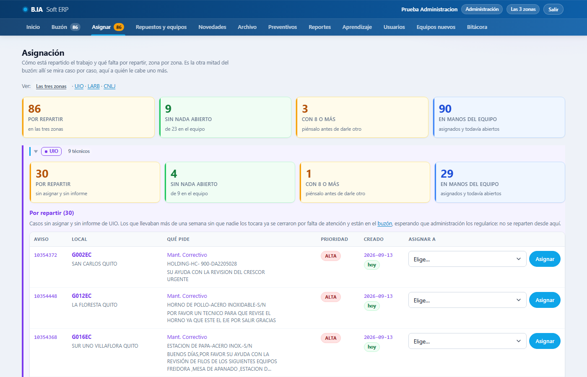

Arriba, cuatro cifras del conjunto: **Sin asignar**, **Sin órdenes asignadas** (técnicos libres), **Con 8 o más** (técnicos cargados) y **Asignadas**. Debajo, **un bloque por zona** con las mismas cuatro cifras, su tabla **«Sin asignar»** y **su equipo ordenado por carga**: cada técnico con sus órdenes asignadas, las que están a espera de repuesto y cuántas llevan ya su OT INDUSTEC de cierre (**«OT de cierre»**), más el distintivo «asignadas hace 3+ días» cuando corresponde.

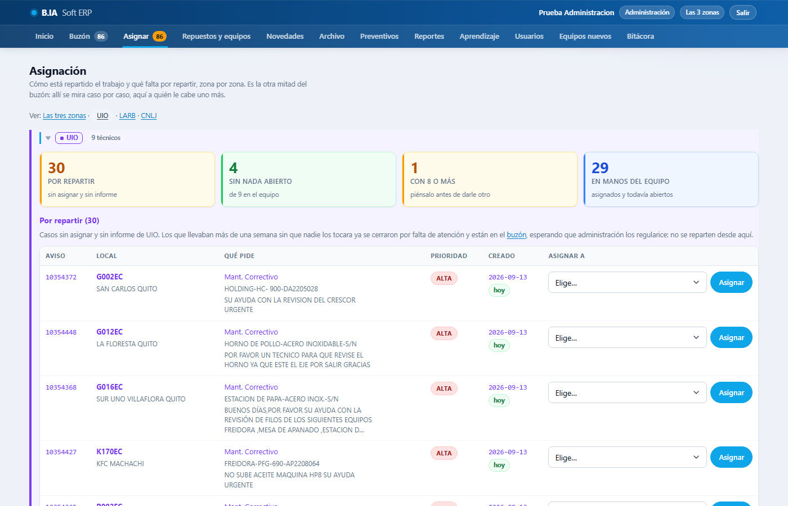

En cada orden eliges un técnico **de esa zona** y pulsas **Asignar**. Un técnico de otra zona se ofrece aparte y exige marcar «confirmo que es de otra zona». Al técnico le llega la notificación en el momento.

## 4. Repuestos y equipos: el flujo con KFC

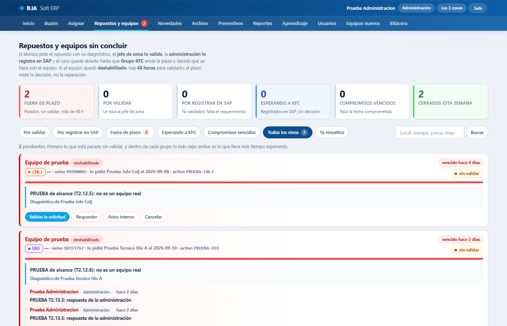

Cada equipo que un técnico dejó sin operar abre una **solicitud**. El flujo, de principio a fin:

| Paso | Estado de la solicitud | Quién |
|---|---|---|
| El técnico envía su OT INDUSTEC de evaluación con el diagnóstico y las piezas | **por validar** | técnico |
| El jefe de zona valida diagnóstico y vía (repuesto, reparación en taller, garantía o baja) | **validada, por registrar en SAP** | jefe de zona (tú, por excepción: queda en bitácora) |
| Registras el requerimiento en SAP (número obligatorio) | **pendiente OK de OP´S** | administración |
| KFC decide: **envía el repuesto** · **a taller de INDUSTEC** · **a otro proveedor** (con el nombre del tercero) · **da de baja el equipo** | **repuesto despachado** · **en taller de INDUSTEC** · **con otro proveedor** · **baja aprobada por KFC** | administración anota la decisión con **«KFC decidió»** |
| La pieza llega, o el equipo vuelve del taller | **repuesto en el local** · **de vuelta del taller** | administración, con **«Avanzar»** |
| El técnico instala y envía la OT INDUSTEC de cierre | **terminada** (sola) | técnico |

Los filtros de arriba son tu lista de trabajo: **Por registrar en SAP** (abre por defecto), **Vencidas (48 h)**, **PENDIENTE OK OP´S**, **Compromisos atrasados**, **En trámite** y **Terminadas y canceladas**. Aparte, el bloque **«Sin aviso SAP»** reúne los equipos deshabilitados de una OT INDUSTEC que nació sin aviso: hay que crearle el aviso en SAP. Cada solicitud tiene su hilo: las insistencias del técnico con fecha, tus respuestas, las del jefe y los cambios de estado. **Avanzar** permite corregir un estado (al retroceder pide nota); **Cancelar** la deja **cancelada (no procedía)**, con motivo.

El plazo de **48 horas** mide la validación del jefe, no la respuesta de KFC. El cumplimiento de cada zona sale en Reportes.

## 5. Novedades

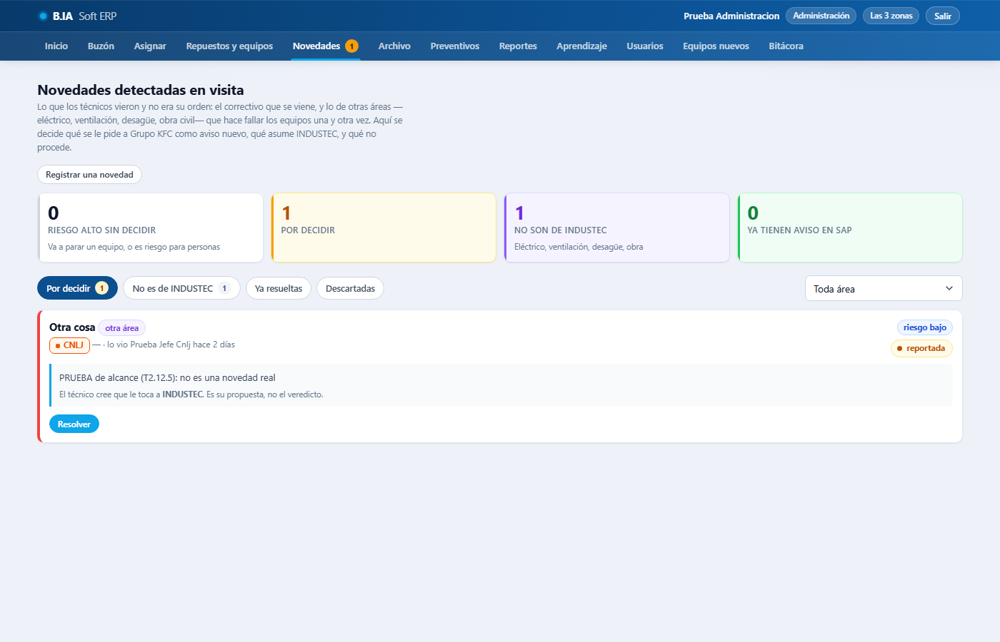

Lo que los técnicos vieron en las visitas y no era su orden. Las resuelves igual que el jefe de zona, con **«¿Qué se hace con esta novedad?»**: **con aviso SAP** (se le pidió el aviso a KFC), **la asume INDUSTEC**, **en estudio**, **descartada** (con motivo) o **resuelta**. Los filtros: **Por decidir**, **De otras áreas** (eléctrico, ventilación, desagüe, obra civil), las que ya tienen destino y **Descartadas**. Puedes **registrar una novedad** que llegó por otro canal, con el local del maestro.

## 6. Reportes: por zona, por mes, y para KFC

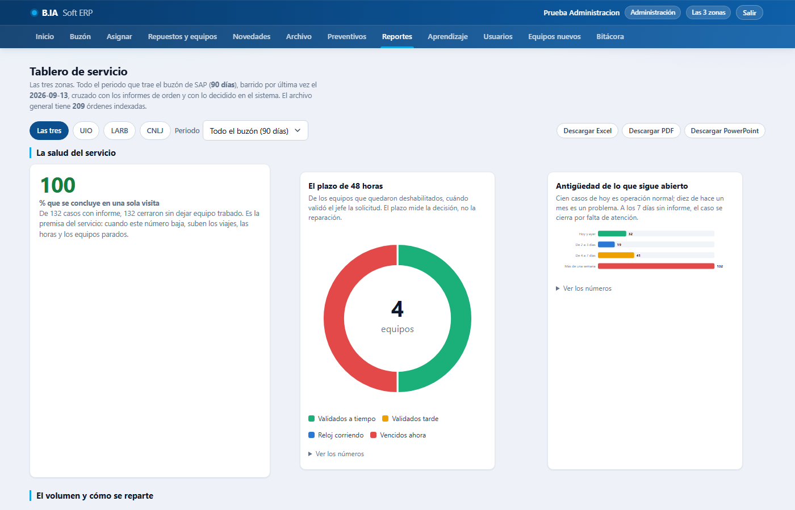

Arriba, los filtros rápidos por zona (las tres, UIO, LARB, CUENCA-LOJA) y el **mes**. Secciones del **Tablero de servicio**: la salud del servicio (cumplimiento de 48 horas, antigüedad del total de órdenes abiertas, semáforo), el volumen y cómo se reparte, **rendimiento por técnico**, **cumplimiento del preventivo**, dónde se concentra el trabajo, locales que repiten, qué hace fallar los equipos y otros trabajos para Grupo KFC.

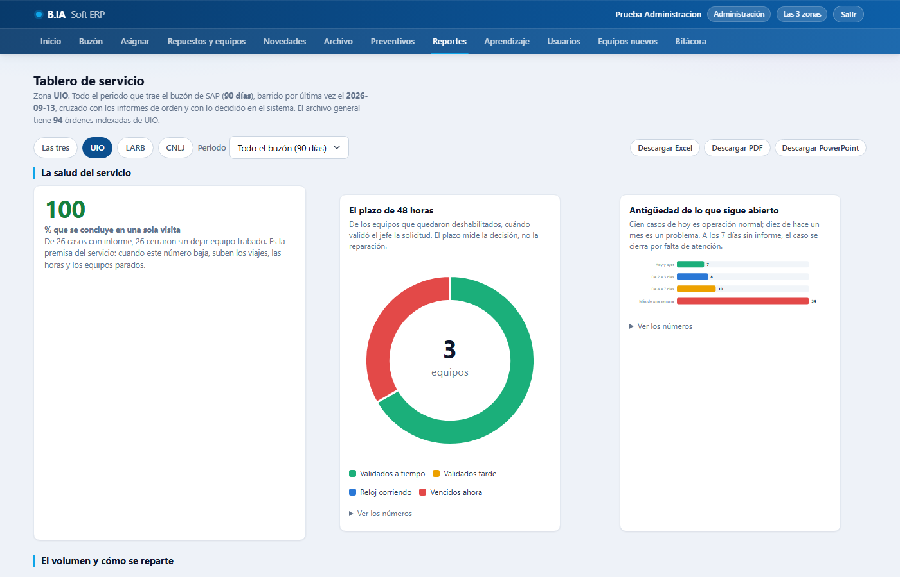

**Descargar Excel / PDF / PowerPoint**: el mismo tablero con el formato de INDUSTEC y **los mismos términos** de la pantalla. El Excel trae las hojas Resumen, TOTAL DE ÓRDENES ABIERTAS (con semáforo y autofiltro), Por zona, Rendimiento técnicos, Cumplimiento 48h, Preventivo, Novedades, Locales y Otros trabajos; el PowerPoint, las diapositivas 16:9 para la reunión con KFC. Cada exportación queda en la bitácora.

## 7. Preventivos: el cronograma de las tres zonas

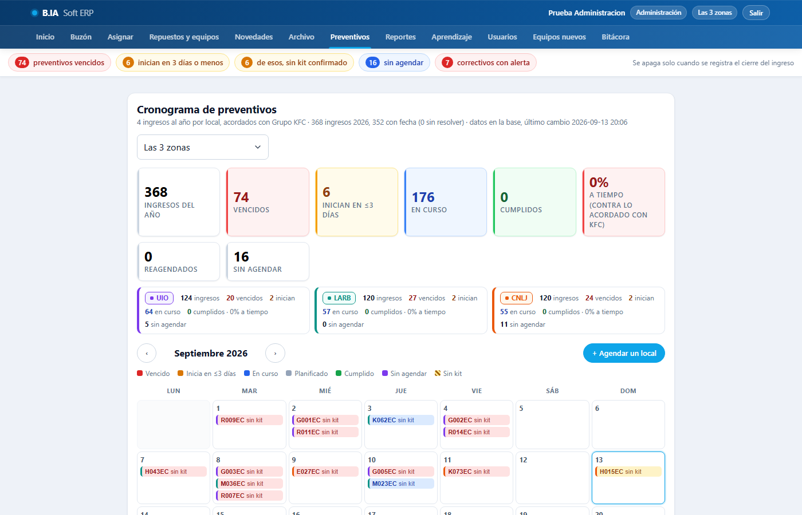

El cronograma con la **marca de zona** en cada fila y tres vistas: **Lo que toca**, **El mes** y **El año y KFC**. Cada ingreso preventivo está **Ejecutado**, **Pendiente** (también «arranca en 3 días o menos», «sin agendar» o «en ejecución») o **Atrasado** (también «atrasado · por marcar como ejecutado»). Las mismas acciones que el jefe: kit de mantenimiento, **Reagendar** con motivo, **Marcar como ejecutado**, **Agendar**, y anotar un **movimiento del ingreso**. El cumplimiento se mide contra el **plan acordado con KFC**, y los motivos de reagenda salen en Reportes.

## 8. Archivo de OT INDUSTEC, de todas las zonas

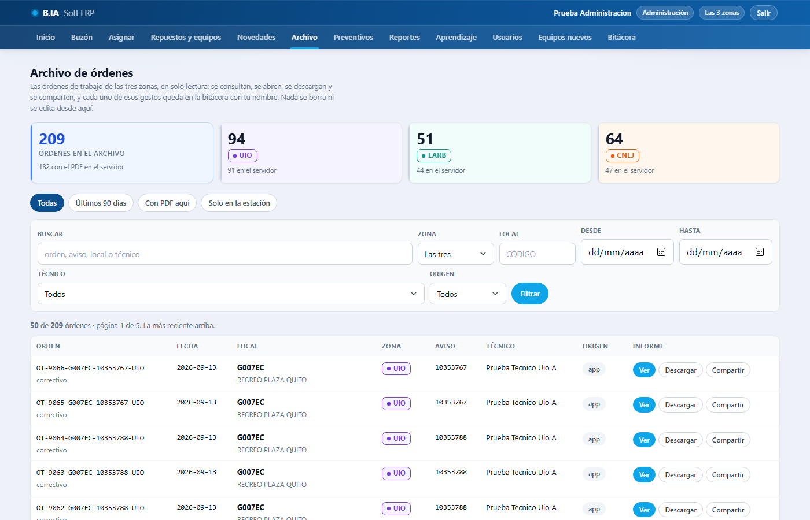

El índice de todas las OT INDUSTEC: las emitidas por la app, las que el sistema viejo sigue produciendo (las trae la estación cada noche) y el histórico. Filtros por zona, local, técnico, fechas, origen y «dónde está el PDF». Ver y descargar quedan registrados por separado.

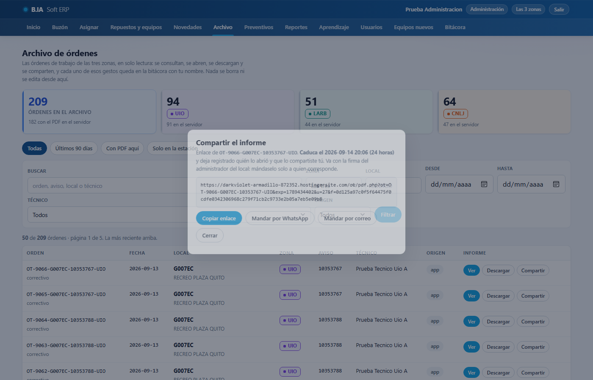

**Compartir** genera un enlace firmado que caduca a las 24 horas, para mandárselo al local; la bitácora guarda quién lo compartió y quién lo abrió. Las OT INDUSTEC históricas cuyo PDF está solo en la estación muestran **«Pedir copia»**; la petición queda registrada para que la estación la suba. Subir el histórico completo a Hostinger es una decisión pendiente de Andrés.

## 9. Aprendizaje: manuales, guías y comunicados con aprobación

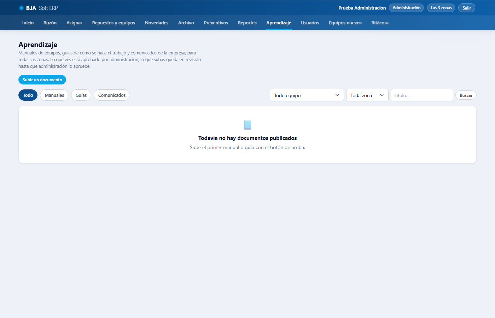

Los jefes suben manuales y guías y los técnicos los proponen; quedan **por aprobar** y **tú apruebas** (o rechazas con nota, o retiras uno publicado). Cada aprobación publica una **versión** con su huella; el mismo archivo no entra dos veces. Un **comunicado** puede pedir acuse: «visto por 4 de 6» te dice quién lo leyó. Todo queda en la bitácora: quién subió, quién aprobó, quién abrió, quién descargó.

## 10. Equipos nuevos por confirmar

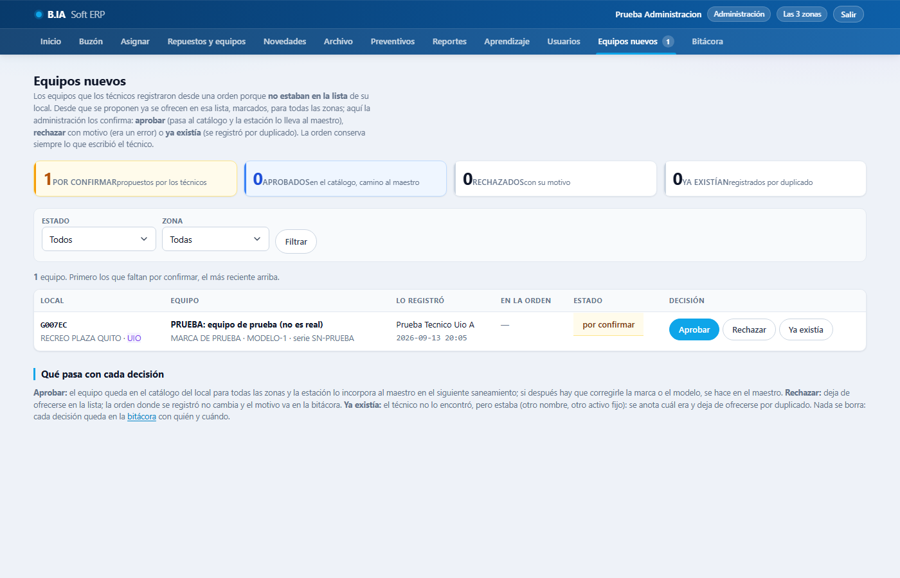

Cuando un técnico registra en una OT INDUSTEC un equipo que **no estaba en la lista** del local, el equipo aparece de inmediato en esa lista (marcado **«por confirmar»**) y en **Equipos nuevos** para que lo confirmes: **aprobar** (pasa al catálogo y la estación lo incorpora al maestro), **rechazar** con nota (era un error) o marcar que **ya existía** (se fusiona con el que estaba). Nada se pierde: la OT INDUSTEC conserva el equipo tal como lo escribió el técnico.

## 11. Usuarios

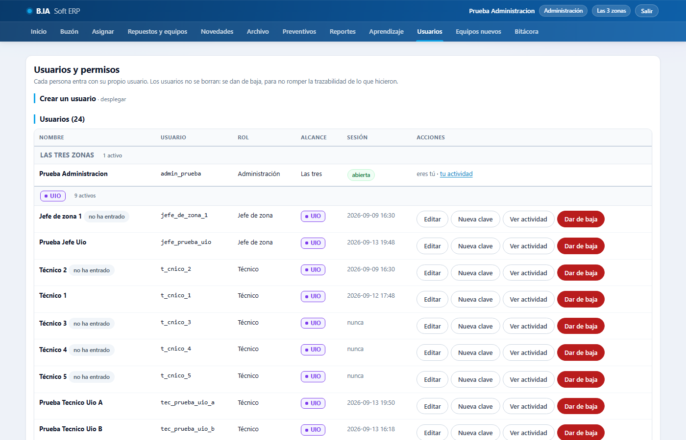

Agrupados por zona. **Crear un usuario** (técnico o jefe de zona; la dirección crea también administración), **editar** nombre, correo, zona y rol (si cambias de zona a un técnico con órdenes asignadas, el sistema te avisa cuántas), **Nueva clave** (temporal, se muestra una sola vez, y obliga a cambiarla), desactivar (nunca borrar), y **«Ver actividad»**, que abre la bitácora filtrada por esa persona. Las reglas de las claves y las sesiones están en [`CUENTAS.md`](CUENTAS.md).

## 12. Bitácora: la trazabilidad de todo

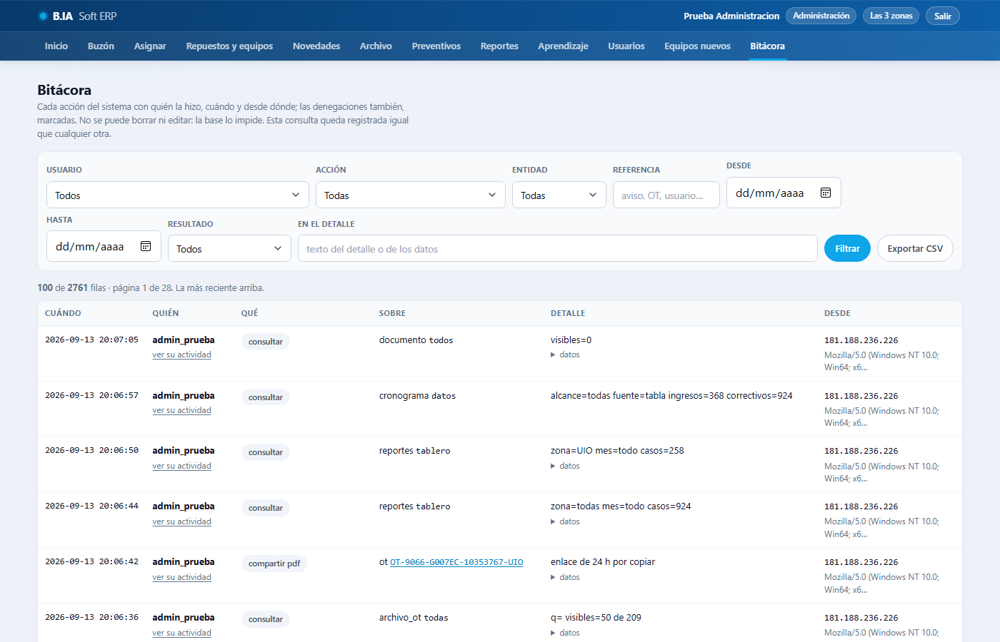

Cada acción de cada usuario, con fecha, resultado (hecho o rechazado), estado antes y después y los datos. Filtros por usuario, acción, entidad (orden, solicitud, OT INDUSTEC, documento, usuario…), referencia, fechas y texto; exporta a **CSV**. Nadie puede borrar ni editar una fila de la bitácora, ni siquiera la dirección: la base lo impide.

## 13. Lo que el sistema no hace solo, a propósito

- **No cierra órdenes por falta de atención** sin que lo confirmes (la cifra aparece en Inicio; el botón pide confirmación).
- **No manda correos** desde el sitio de pruebas: las OT INDUSTEC quedan con su PDF y el correo **retenido** hasta el corte.
- **No decide** si una orden corresponde a INDUSTEC: la alerta la señala como «fuera del área, por decidir» y la resolución es tuya.
- **No borra** nada: órdenes, OT INDUSTEC, solicitudes, documentos y usuarios se cancelan, retiran o desactivan.

## Si algo no funciona

[`COMO_REPORTAR_FALLOS.md`](COMO_REPORTAR_FALLOS.md): el canal y los datos. La bitácora te sirve para reconstruir qué hizo cada quien antes de reportarlo.
