# Hoja del jefe de zona — repartir, validar y seguir a tu equipo

> Para el jefe de zona de UIO durante el piloto. Se lee en 15 minutos. Las pantallas son capturas reales del sitio de pruebas, tomadas con una cuenta de prueba de jefe de UIO: los nombres del personal están reemplazados por «Técnico 1», «Técnico 2»…

## Qué ves y qué no

Ves **tu zona**: sus casos, sus técnicos, sus repuestos, sus novedades, su cronograma y sus reportes. La regla se aplica en el servidor, no escondiendo botones: pedir otra zona por la dirección devuelve vacío. Lo único de todas las zonas es el **Archivo** de órdenes (solo consulta) y el **Aprendizaje**.

Entras en `https://darkviolet-armadillo-872352.hostingersite.com/ot/login.php` desde cualquier computador (también funciona en el celular). La primera vez el sistema te pide cambiar la clave temporal. Ver [`CUENTAS.md`](CUENTAS.md).

## 1. Inicio: lo que te toca ahora

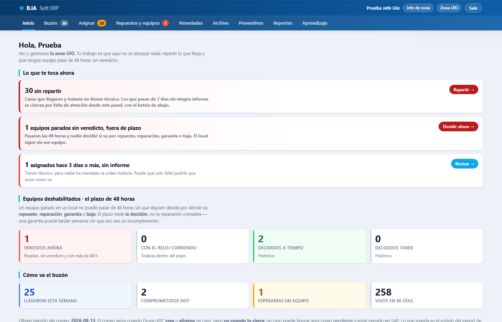

El tablero no es un menú: es la lista de lo que **solo tú** puedes resolver hoy, con la cifra y el enlace que te deja delante de esos casos. Las líneas que aparecen cuando hay algo:

- **casos sin repartir** en tu zona → «Repartir» te lleva a Asignar, con la lista ya filtrada.
- **asignados hace 3 días o más, sin informe** → «Revisar»: técnicos que tienen el caso y todavía no mandaron la orden.
- **equipos deshabilitados sin veredicto** → el reloj de las **48 horas**: un equipo parado en un local cuya solicitud de repuesto nadie ha validado.
- **novedades por decidir** → lo que reportaron tus técnicos en las visitas.

Debajo, «Cómo va el buzón» (cuándo llegó el último caso de SAP) y «Equipos deshabilitados · el plazo de 48 horas».

## 2. Buzón: los casos de tu zona

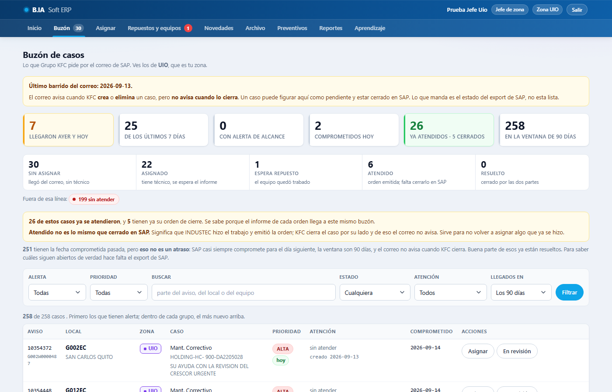

Cada fila es un aviso de SAP: local, equipo, qué pidió KFC, estado y técnico. Filtra por estado, local o texto (el buscador entiende `2466` como parte de `OT-2466-…` y el aviso con o sin ceros).

| Estado | Qué significa |
|---|---|
| sin asignar | Llegó del correo de SAP y no tiene técnico |
| asignado | Tiene técnico; se espera la orden |
| espera repuesto | El técnico fue y el trabajo depende de un repuesto |
| en revisión | Lo mandaste a la administración con un motivo (no es de INDUSTEC, el local no corresponde, hay que consultar) |
| atendido | Se emitió la orden; falta que la administración lo cierre en SAP |
| resuelto / no nos compete | Cerrado por la administración |
| sin atender | Pasó una semana sin ninguna orden y la administración lo cerró; hay que regularizarlo ante KFC |

Tus acciones sobre un caso:

- **Asignar** (también desde la pantalla Asignar).
- **En revisión**: lo pasas a la administración con el motivo escrito; ella da el veredicto.
- **Pedir seguimiento**: le escribes una nota al técnico («¿cómo va el caso del local X?»); le llega a sus Avisos y queda en el historial del caso.

«Veredicto» y «Derivar» son de la administración. «Qué hace cada acción», al pie de la pantalla, lo explica.

## 3. Asignar: repartir el trabajo

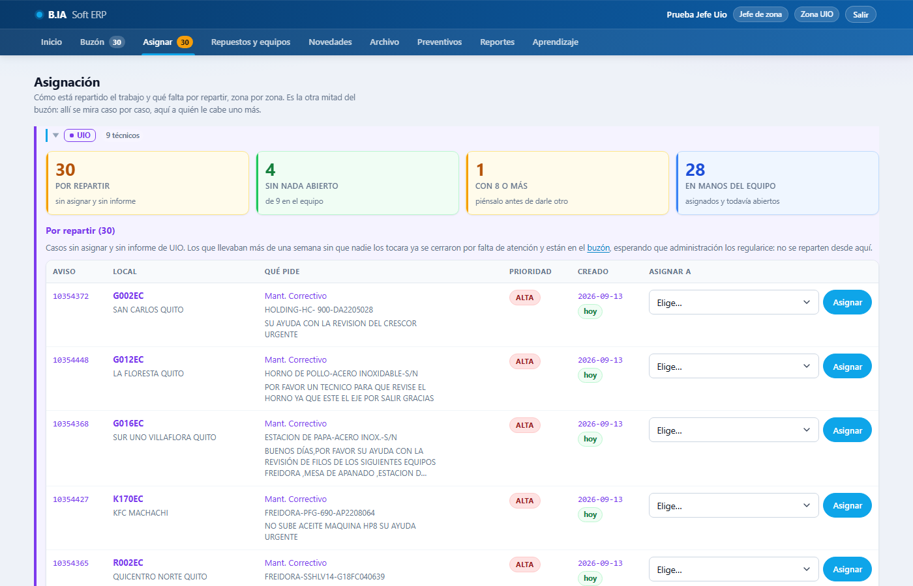

La pantalla tiene **un bloque por zona** (tú ves el tuyo) con cuatro cifras arriba: **por repartir**, asignados, esperando repuesto y atendidos. Toca **«por repartir»** y la tabla de abajo se filtra a esos casos.

Debajo, **tu equipo ordenado por carga**: cada técnico con cuántos casos tiene abiertos, cuántos esperan repuesto y cuántos lleva atendidos. Así repartes al que tiene menos.

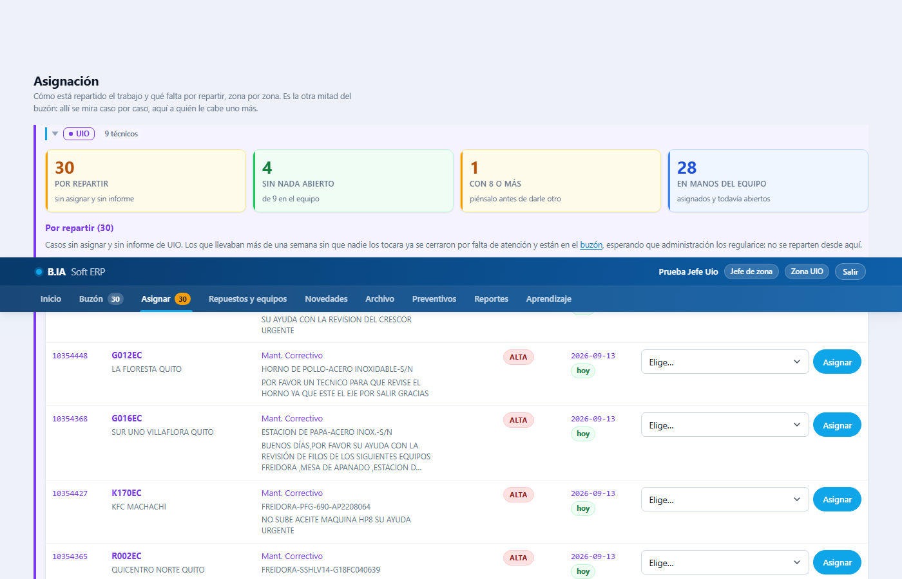

En la tabla, cada caso trae el desplegable con **los técnicos de tu zona**; eliges y pulsas **Asignar**. Al técnico le aparece el caso en su bandeja y un aviso en el momento. Si necesitas asignar a un técnico de **otra zona** (un local vecino), el desplegable lo ofrece aparte y te pide marcar «confirmo que es de otra zona»: se permite, y queda en la bitácora.

Reasignar es lo mismo sobre un caso ya asignado: al técnico anterior le llega «te quitaron el caso» y al nuevo «te asignaron».

## 4. Repuestos: validar la solicitud

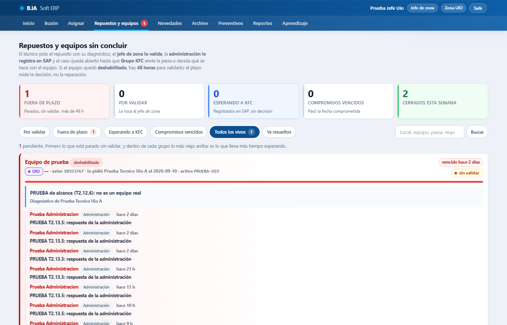

Cuando un técnico envía una orden **no concluida** por un repuesto, se abre un pendiente en estado **Solicitado** con su diagnóstico y las piezas que pidió. Tu parte es **validar**: confirmar que el diagnóstico es correcto y que el repuesto es el que corresponde. La pantalla abre por defecto en **«por validar»**.

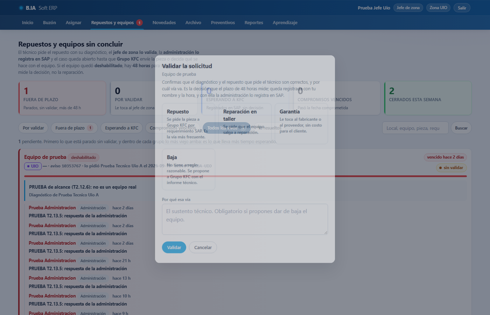

**Validar** te pide la vía (repuesto, reparación en taller, garantía o baja) y una nota. Con tu validación, la administración lo **registra en SAP** con el número del requerimiento, y el caso queda abierto hasta que KFC decida (envía el repuesto, taller INDUSTEC, otro proveedor o baja). Cuando el técnico instala el repuesto y envía la orden **concluida**, el pendiente se resuelve solo.

El reloj de **48 horas** mide **tu validación**: es la decisión de INDUSTEC. Lo que tarde KFC se mide aparte y no cuenta contra la zona.

También puedes **Responder** en el hilo del pendiente (el técnico lo ve en sus Avisos) y ver los tiles «esperando a KFC» y «compromisos vencidos» para hacer seguimiento.

## 5. Novedades de las visitas

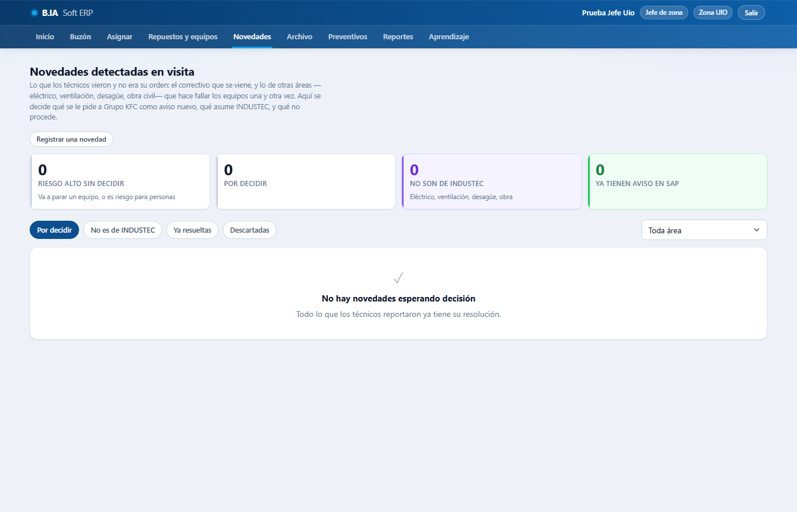

Lo que el técnico vio en el local y no era su orden: otro equipo fallando (el correctivo que se viene) o un problema de **otra área** (eléctrico, ventilación, desagüe, obra civil) que hace fallar los equipos una y otra vez. El técnico **propone** de quién es; tú decides con **«¿Qué se hace con esta novedad?»**: la asume INDUSTEC, se deriva a SAP (con el aviso, cuando KFC lo abra), se descarta con motivo, o ya está resuelta. Al técnico le llega un aviso con tu decisión.

**«Registrar una novedad»** sirve para anotar una que llegó por teléfono o por WhatsApp, eligiendo el local del maestro.

## 6. Preventivos: el cronograma de tu zona

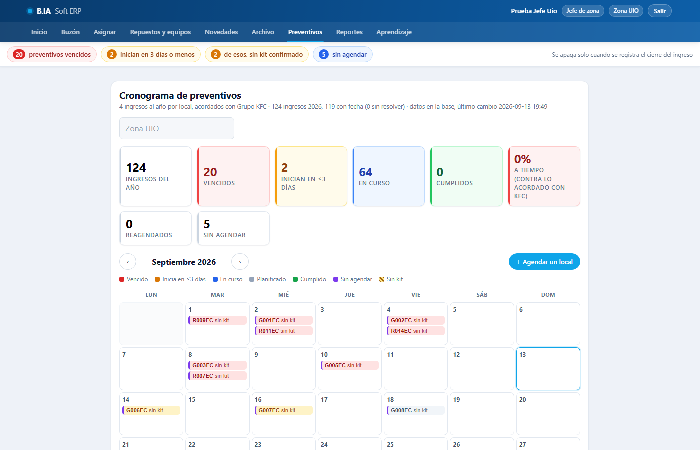

El cronograma mensual con los ingresos preventivos de tus locales. Los tiles de arriba: cumplidos, **% a tiempo**, reagendados y **sin agendar**. Cada fila es un ingreso; al tocarla se abre su panel con:

- **Kit de mantenimiento**: confirmar que llegó (o marcar pendiente).
- **Reagendar**: fecha nueva **con motivo obligatorio** (kit no llegó, local cerrado, técnico enfermo…). El plan original se conserva: el cumplimiento se mide contra él.
- **Cerrar el ingreso**: cuando la orden preventiva está enviada; se anota a tiempo o tarde.
- **Agendar**: para un local del mes que quedó sin fecha.

Al técnico le llega el ingreso en su cronograma, y el formulario le abre prellenado en preventivo con el local y sus equipos.

## 7. Reportes de tu zona

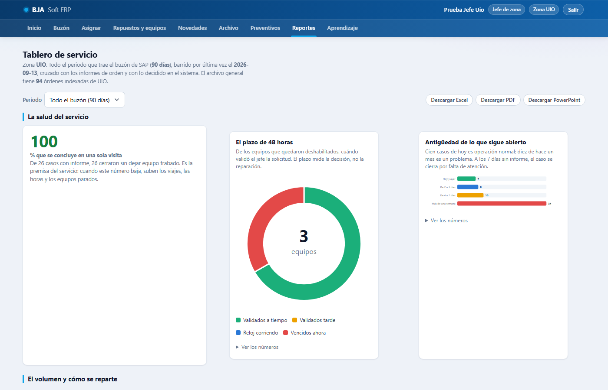

El tablero de servicio con tus datos: salud del servicio, volumen, **rendimiento por técnico** (asignados, con orden, concluidos en una visita, días a la primera atención, pendientes vencidos, novedades), **cumplimiento del preventivo** (a tiempo, tarde, vencidos, sin agendar, motivos de reagenda), locales que repiten y qué hace fallar los equipos. Puedes cambiar el **mes** y **descargar en Excel, PDF o PowerPoint** con el formato de INDUSTEC.

## 8. Archivo y Aprendizaje

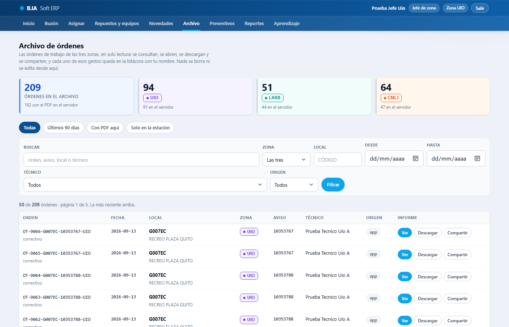

**Archivo**: las órdenes de las tres zonas (las de la app y las históricas), con filtros por zona, local, técnico, fechas y origen; ver, descargar y **compartir** (enlace de 24 horas para el local). Solo consulta; cada acción queda registrada.

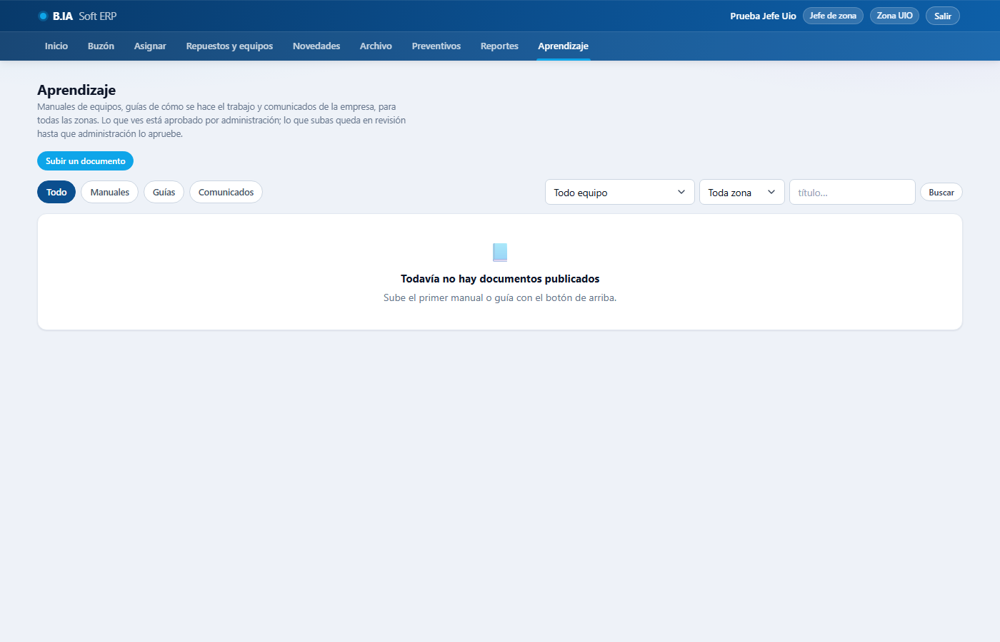

**Aprendizaje**: manuales, guías y comunicados. Puedes **subir** un manual o una guía (por tipo de equipo y zona); queda **en revisión** hasta que la administración lo apruebe y se publique con su versión. Lo que propongan tus técnicos también pasa por ahí.

## 9. Lo que el sistema te evita hacer, y por qué

- Dar veredicto o derivar un caso: es de la administración, que lo cierra en SAP.
- Resolver un caso con un pendiente vivo: primero se resuelve el repuesto.
- Borrar algo: nada se borra; se cancela o se corrige con nota, y la bitácora guarda quién y cuándo.
- Ver la clave de un técnico: si la olvidó, la administración le genera una nueva.

## Si algo no funciona

[`COMO_REPORTAR_FALLOS.md`](COMO_REPORTAR_FALLOS.md): a quién escribir y qué datos mandar.
