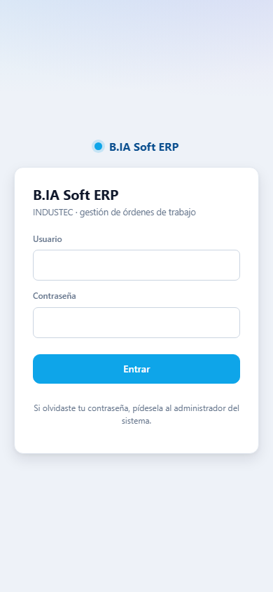
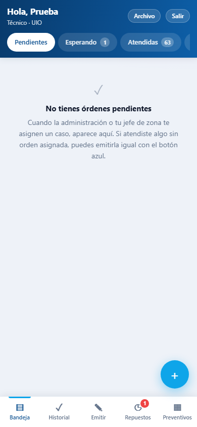
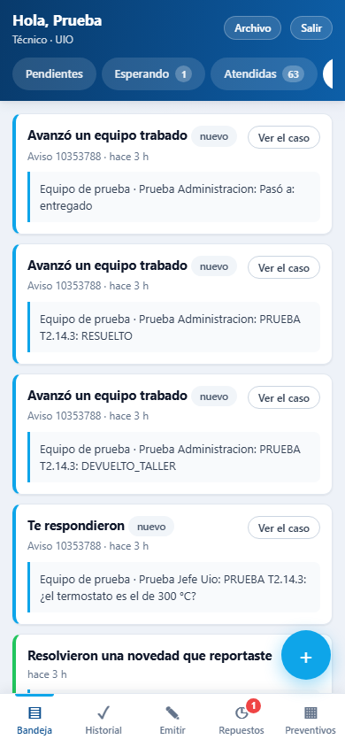
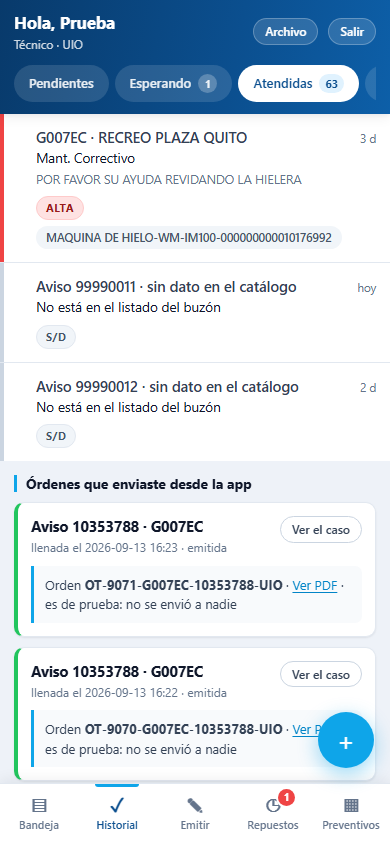
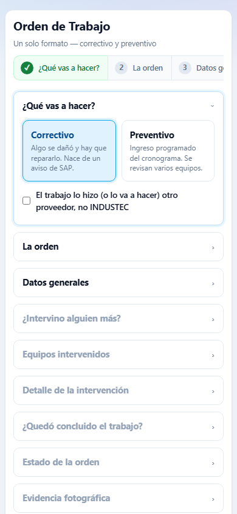
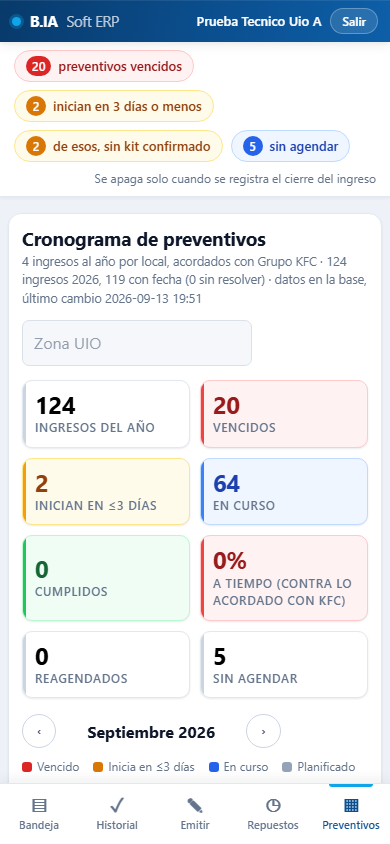
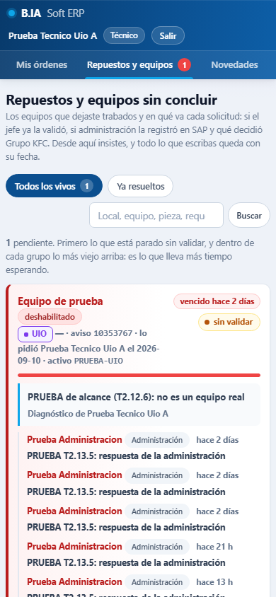
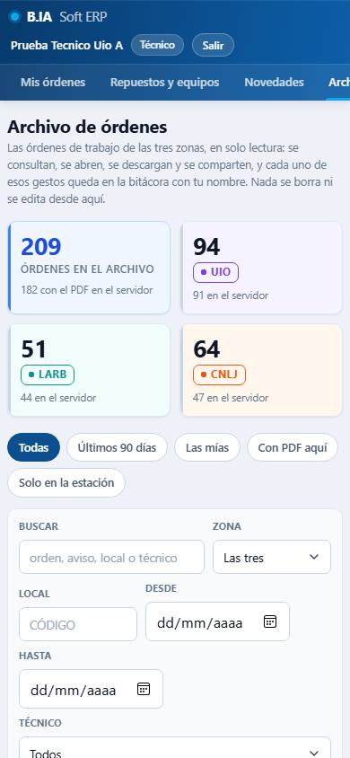
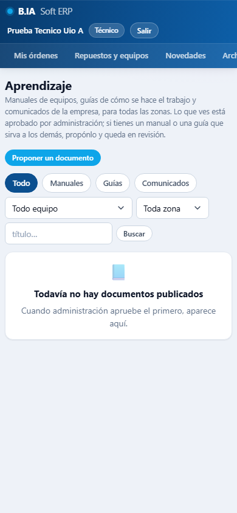

# Hoja del técnico — la app de órdenes de trabajo

> Para los técnicos de la zona UIO durante el piloto. Se lee en 10 minutos. Las pantallas son capturas reales del sitio de pruebas, tomadas con una cuenta de prueba: los nombres que aparecen no son de personas reales.

## Qué cambia para ti

Hoy llenas la orden en el formulario de siempre y el PDF te llega por correo. Con la app:

- **Tus casos ya vienen cargados**: el local, el equipo y lo que pidió KFC. No tecleas números.
- **El administrador del local, los diagnósticos y los repuestos se eligen** de listas que ya conocen tu trabajo. Puedes editar el texto.
- **La orden sale aunque no tengas señal**: se guarda en el celular y se envía sola cuando vuelve la conexión.
- **Ves el PDF de cada orden** en el momento, y el archivo de todas las órdenes de INDUSTEC, de todas las zonas, para consultar.
- Un **buzón de avisos** te cuenta cuando te asignan o te quitan un caso, cuando responden sobre un repuesto o cuando resuelven una novedad tuya.

Durante el piloto **sigues mandando la orden por el formulario viejo además de por la app**: así, si algo falla, no se pierde nada. Al corte se apaga el viejo.

## 1. Entrar y dejar la app en el celular

1. Abre `https://darkviolet-armadillo-872352.hostingersite.com/ot/` en el navegador del celular.
2. Escribe tu **usuario** y la **clave temporal** que te dio la administración. La primera vez, el sistema te pide cambiarla: escribe la temporal, la nueva y repítela. La nueva es tuya.
3. Agrégala a la pantalla de inicio: en Chrome (Android) menú ⋮ → **«Agregar a la pantalla principal»**; en Safari (iPhone) botón de compartir → **«Agregar a inicio»**. Desde ahí abre como una app y funciona sin señal.

Si te equivocas cinco veces con la clave, el ingreso se bloquea 15 minutos. Si la olvidas, pídele una nueva a la administración.

## 2. Tu bandeja: «Mis órdenes»

Es lo primero que ves. Tiene cuatro pestañas:

| Pestaña | Qué hay |
|---|---|
| **Pendientes** | Los casos que te asignaron y todavía no tienen orden. Cada uno muestra el aviso de SAP, el local, el equipo y desde cuándo está asignado. |
| **Esperando** | Los casos donde ya fuiste y el trabajo depende de un repuesto o de una decisión. |
| **Atendidas** | Las órdenes que ya enviaste desde la app, con su número y su **PDF** (botón «Ver»). Las de número 90xx son de las pruebas automáticas, no del piloto. |
| **Avisos** | Lo que antes te llegaba por WhatsApp: te asignaron o te quitaron un caso, te respondieron sobre un equipo trabado, te resolvieron una novedad, te pidieron seguimiento. El globo con número dice cuántos avisos nuevos hay. |

 

Abajo va la **barra**: Bandeja · Historial · Emitir · Repuestos · Preventivos; el globo rojo sobre Repuestos avisa de un equipo parado. Arriba a la derecha, **Archivo** (las órdenes de todas las zonas) y **Salir**. El botón azul **+** es lo mismo que Emitir: una orden nueva. Novedades y Aprendizaje se abren desde los enlaces de la bandeja y del formulario.

## 3. Llenar una orden

Toca **«Nueva orden»** (o el caso, desde Pendientes). El formulario va por pasos; cada paso se abre cuando el anterior está completo y muestra un ✓ al plegarse.

1. **¿Qué vas a hacer?** Correctivo (un caso de SAP), preventivo (un ingreso del cronograma) u **otro proveedor** (un trabajo donde interviene un tercero: se anota su nombre y qué hizo).
2. **La orden.** Elige el caso en **«De mis órdenes»**: el local, el equipo y el tipo de requerimiento se llenan solos. Si atendiste algo sin aviso, marca «Sin orden asignada» y di por qué.
3. **Datos generales.** Fecha de atención, local (ya viene), **administrador del local**: elige uno de los ya ingresados o escribe uno nuevo. Si intervino otro técnico, «+ Añadir otro técnico».
4. **Equipos intervenidos.** El equipo del aviso viene preseleccionado. «+ Añadir equipo» para otro del mismo local. Si el equipo **no está en la lista**, elige «Equipo nuevo / no está en la lista» y escribe marca, modelo y serie: queda guardado para todas las zonas y la administración lo confirma en el catálogo.
5. **Detalle de la intervención.** Inicio y fin, **actividades realizadas** (elige un **diagnóstico pre-redactado** por tipo de equipo y complétalo con lo que viste), **¿Se usó repuesto?** y su detalle (pieza, cantidad, número de parte si lo sabes).
6. **¿Quedó concluido el trabajo?** Si **no**, la orden queda **abierta** y te pide: qué encontraste y por qué no se pudo cerrar, qué equipo es y **qué repuesto haría falta**. Con eso se abre la solicitud de repuesto sin que tengas que hacer nada más (ver el punto 5).
7. **Evidencia fotográfica.** Toma las fotos desde la app. Una foto demasiado grande se recorta sola; si una no sube, la orden sale igual y lo dice.
8. **¿Viste algo más en el local?** «+ Reportar una novedad»: lo que no era tu orden (otro equipo fallando, un problema eléctrico, de ventilación, de obra civil). Le llega al jefe de zona.
9. **Satisfacción del cliente** y **firma del administrador** en pantalla.
10. **«Revisar y enviar».** Ves cómo va a quedar archivada y envías.

Al enviar, la pantalla te muestra **el número real de la orden y el enlace al PDF**. Si no había señal, dice «en cola» y sale sola al reconectar; la ves en Atendidas cuando llegue.

Si una orden te la **rechazan** (te lo dicen en Avisos), la abres, corriges y reenvías: las fotos y la firma se conservan.

**Lo que la app no deja hacer**, para que la orden llegue completa: enviar sin equipo, sin actividades, sin firma cuando el trabajo quedó concluido, o con una fecha futura. Te lo dice al lado del campo.

## 4. Preventivos

En **Preventivos** ves el cronograma del mes de tu zona: cada local con su día. Toca el local → **«Llenar la orden»** y el formulario abre ya en preventivo, con el local, el día de intervención y sus equipos. Si el kit de mantenimiento no ha llegado o hay que reagendar, se lo dices a tu jefe de zona: él lo cambia en el cronograma con el motivo.

## 5. Repuestos: qué pasa con un equipo que quedó parado

Cuando una orden queda abierta por un repuesto, en **Repuestos** aparece ese equipo con su **estado**:

| Estado | Qué significa |
|---|---|
| Solicitado | Tu solicitud está esperando que el jefe de zona la valide. |
| Validado por el jefe | El jefe confirmó el diagnóstico y el repuesto. La administración lo registra en SAP. |
| Registrado en SAP | Ya tiene número de requerimiento. Se espera a KFC. |
| Esperando a KFC | KFC decide: manda el repuesto, va al taller de INDUSTEC, otro proveedor o baja del equipo. |
| Repuesto enviado / Taller INDUSTEC / Otro proveedor / Baja | Lo que decidió KFC. |
| Resuelto | Se cerró: cuando envías la orden **concluida** de ese equipo, el pendiente se resuelve solo. |

Un equipo parado tiene **48 horas** para que INDUSTEC decida. Si ves que pasa el tiempo, **«Insistir»** deja un recordatorio con fecha en el hilo; ahí también lees lo que respondieron el jefe o la administración.

## 6. Novedades

En **Novedades** están las que reportaste (desde el formulario o con «Registrar una novedad») y qué se decidió con cada una: si la asumió INDUSTEC, si se derivó a SAP, si se descartó o si ya se resolvió. Cuando cambian de estado te llega un aviso.

## 7. El archivo de órdenes, de todas las zonas

En **Archivo** están las órdenes de INDUSTEC de las tres zonas: las emitidas desde la app y las históricas, como en la carpeta de Google Drive. Puedes **buscar** (por orden, aviso, local o técnico), **ver** el PDF, **descargar** y **compartir**: «Compartir» te da un enlace que funciona 24 horas sin usuario, para mandarle el informe al local por WhatsApp. Si una orden histórica muestra «Pedir copia», su PDF está solo en la estación de INDUSTEC: se pide con un toque y la administración lo sube.

No se puede borrar ni editar nada del archivo, y cada consulta, descarga y enlace compartido queda registrado con tu usuario.

## 8. Aprendizaje: manuales y guías

En **Aprendizaje** están los manuales y guías de los equipos, por tipo de equipo y por zona, y los comunicados de la administración. Si tienes un manual que no está, **«Proponer un documento»** lo sube para que un jefe o la administración lo aprueben y quede publicado. Un comunicado con **«Marcar como leído»** le dice a la administración que lo viste.

## Si algo no funciona

Mira [`COMO_REPORTAR_FALLOS.md`](COMO_REPORTAR_FALLOS.md): a quién escribir y qué datos mandar. Lo más útil: una captura, la hora y qué estabas haciendo.
